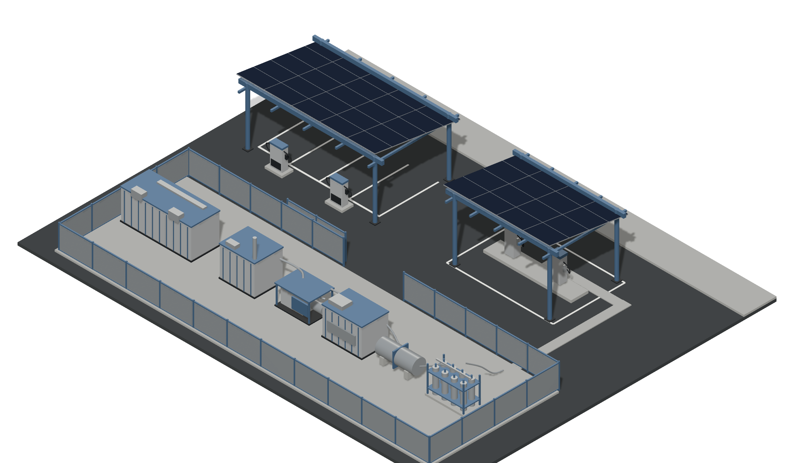
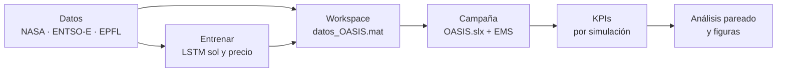

<div align="center">

# OASIS — Gestión energética de una estación de repostaje multi‑energía

**Trabajo Fin de Grado** · Grado en Ingeniería Electrónica, Robótica y Mecatrónica<br/>
Escuela Técnica Superior de Ingeniería · Universidad de Sevilla


[](memoria/main.pdf)




</div>

---

## De qué va esto

Una estación de repostaje que sirve **coches eléctricos y coches de hidrógeno** con lo que produce
su propia fotovoltaica, apoyada en una batería, un electrolizador PEM, dos tanques de hidrógeno a
distinta presión y una pila de combustible. Todo eso está modelado en Simulink; lo que se estudia
aquí es **quién decide, en cada momento, de dónde sale cada kilovatio**.

Se comparan tres gestores de energía construidos uno sobre otro:

| | Versión | Qué hace |
|:--:|---|---|
| **A** | Heurística de referencia | Decide solo con lo que ve: reparte el excedente entre batería y electrolizador, tira de la pila cuando falta, y produce hidrógeno si sale más barato que comprarlo |
| **B** | Predictiva | Añade a A dos decisiones que miran a las próximas horas, usando redes LSTM de irradiancia y de precio |
| **C** | Final | La batería alimenta al electrolizador **antes que la red**, y un planificador elige en qué horas del día conviene producir hidrógeno |

## El resultado, en una tabla

Versión C frente a la heurística de referencia, sobre una semana completa y 20 pares de
escenario × semilla. Cada par comparte exactamente la misma demanda, así que la diferencia no es
ruido del escenario.

| Métrica | Diferencia | Gana | *p* (rangos con signo) |
|---|---:|:--:|---:|
| **Coste total con hidrógeno** | **−52,3 € (−13,9 %)** | 20/20 | 9,6·10⁻⁵ |
| Energía importada de la red | −717 kWh (−54 %) | 20/20 | 9,6·10⁻⁵ |
| Autosuficiencia | +6,7 puntos (87,7 → 94,3 %) | 20/20 | 9,6·10⁻⁵ |
| Ciclado de la batería | ×2,2 | — | *coste declarado* |
| Hidrógeno no servido (día nublado) | 0,82 → 3,07 kg/semana | — | *coste declarado* |

Y el análisis de contribución dice **de dónde sale** esa mejora:

```
A  ──▶ C0   alimentar el electrolizador desde la batería   −47,1 €/semana   ← el 90 % del ahorro
C0 ──▶ C_p  + programar las horas de producción             −5,1 €/semana
C_p ──▶ C   + red neuronal de precio                         0,00 €/semana   ← exactamente cero
```

El tercer escalón es el hallazgo más incómodo y el más interesante: la LSTM de precio **no cambia
nada**, porque a las 13:00 el mercado diario ya ha publicado las horas que la decisión necesita.
La información ya estaba ahí; no hacía falta predecirla.

<details>
<summary><b>Y antes de llegar a C: qué pasó con la versión predictiva</b></summary>

<br/>

Sobre 24 horas y 40 pares, B **iguala en coste** a la heurística (−0,13 €/día, sin significación) y
lo sigue haciendo con previsión perfecta, así que el techo del mecanismo tampoco estaba lejos. Donde
sí mejora de forma sistemática es en el **servicio de hidrógeno**: mantiene el tanque de alta más
lleno y pasa menos tiempo en nivel crítico, y el efecto escala con la calidad de la previsión.

El diagnóstico que reorientó el trabajo salió de descomponer la factura de A: el **76 % de la
energía que compraba a la red iba al electrolizador**, a 121,5 €/MWh de media, mientras la batería
estaba al 85 % de carga y nunca bajaba del 69 %. Ese es el hueco que cierra la Versión C.

</details>

## Cómo reproducirlo



**1 · Datos** — Los CSV ya están en `codigo/data/`. Para regenerarlos:

```bash
python codigo/python/descargar_entsoe.py      # precio, demanda, solar y eólica
python codigo/python/unificar_datos_entsoe.py
python codigo/python/preparar_features_exogenas.py
python codigo/python/descarga_desl_epfl.py    # sesiones de carga
python codigo/python/descarga_caltech.py
```

**2 · Modelos LSTM** — Los entrenados están en `codigo/modelos/`. Para reentrenar,
`codigo/entrenar/Modelo_LSTM_NASA.m` y `Modelo_LTSM_Precio_Luz.m`. Ojo: los dos traen
`SOLO_EVALUAR = true` para no sobrescribir las redes con las que se ejecutó la campaña.

**3 · Workspace de Simulink** — `codigo/preparar/preparar_workspace_simulink.m` construye
`datos_OASIS.mat` una sola vez.

**4 · Campaña** — Cada tanda es una llamada a `campana_simulacion(etiqueta, opciones)` con un EMS
pegado a mano en el bloque `MATLAB Function` de `OASIS.slx`. Antes de cada tanda, `clear functions`
y `clear ORACULO MERCADO_DIARIO`; después, `verificar_tanda(T, etiqueta)`.

```matlab
campana_simulacion('E_8', struct('dias_sim', 7, 'semillas', 1:5, 'decimar_guardado', 10))
```

<details>
<summary>Las seis tandas de la campaña reportada</summary>

<br/>

| Etiqueta | EMS que se pega | `MERCADO_DIARIO` | Horizonte | Semillas |
|---|---|:--:|---|---|
| `A_8` | `ems_A.m` | — | 1 día | 1:10 |
| `B_prima2_8` | `ems_B.m` | — | 1 día | 1:10 |
| `A_8_semana` | `ems_A.m` | — | 7 días | 1:5 |
| `E_8` (Versión C) | `ems_C.m` | 1 | 7 días | 1:5 |
| `E0_8` (C0) | `ems_C0.m` | — | 7 días | 1:5 |
| `E_sinLSTM_8` (C_p) | `ems_C.m` | 2 | 7 días | 1:5 |

`MERCADO_DIARIO` selecciona el modo de la S‑Function de precio: `1` = red neuronal en el tramo aún
no publicado, `2` = persistencia de 24 h, sin definir = señal combinada. Los cuatro escenarios son
los que trae la función por defecto; el `decimar_guardado = 10` de las tandas semanales hay que
pasarlo a mano, como en la llamada de ejemplo, o cada `.mat` ocupa unos 28 MB.

El `_8` de las etiquetas es el precio del hidrógeno externo, 8 €/kg, que es el valor por defecto de
`H2_PRECIO_EXT_KG` en los cuatro ficheros de EMS. La campaña de sensibilidad a 6,12 €/kg (índice
Mibgas) se reproduce cambiando esa constante antes de pegar el EMS.

</details>

**5 · Análisis** — `analizar_todo(struct('referencia', 'A_8_semana'))` agrega los `.mat`, calcula
las diferencias pareadas con el test de rangos con signo y descompone la importación por destinos.

**6 · Figuras y memoria** — `figuras_memoria()` genera las figuras del capítulo de resultados en
`memoria/img/`. Para compilar la memoria, desde la raíz del repositorio:

```bash
typst compile --root . memoria/main.typ
```

## Estructura del repositorio

| Carpeta | Contenido |
|---|---|
| `SimugridElectrolinera/` | El modelo `OASIS.slx`, su script de arranque `init_OASIS.m` y las dos S‑Functions de previsión |
| `codigo/EMS/` | Los cuatro gestores de energía: `ems_A.m`, `ems_B.m`, `ems_C.m` y `ems_C0.m`. Se pegan en el bloque `MATLAB Function` del modelo |
| `codigo/herramientas/` | Campaña de simulación, extracción de KPIs, contraste pareado, descomposición de la factura y figuras |
| `codigo/preparar/` | Generación de la demanda de vehículos y del workspace de Simulink |
| `codigo/entrenar/` | Entrenamiento de las dos redes LSTM |
| `codigo/modelos/` | Redes ya entrenadas (`.mat`) que consumen las S‑Functions |
| `codigo/python/` | Descarga y análisis de los datos, y figuras del capítulo de datos |
| `codigo/data/` | Datos descargados y procesados |
| `codigo/resultados/` | CSV con los KPIs de la campaña reportada y sus agregados |
| `memoria/` | Fuente de la memoria en Typst y el PDF compilado |

<details>
<summary>Correspondencia de nombres entre la memoria, los ficheros y los CSV</summary>

<br/>

En la memoria las versiones son **A**, **B** y **C**, con **C0** = C sin planificador y **C_p** = C
con persistencia en la cola del horizonte. Los ficheros del EMS se llaman igual. Las etiquetas de
los CSV de resultados conservan los nombres con los que se ejecutó la campaña —`A`, `B_prima2`,
`E`, `E0` y `E_sinLSTM`— porque renombrarlas obligaría a repetirla.

</details>

## Requisitos

- **MATLAB R2023b** o posterior, con Simulink, Deep Learning Toolbox y Statistics and Machine
  Learning Toolbox. GPU opcional para el entrenamiento.
- **Python 3.10** o posterior con `pandas`, `numpy`, `matplotlib`, `requests` y `openpyxl`.
- **[Typst](https://typst.app/)** para compilar la memoria.

## Datos y referencias externas

| Fuente | Uso |
|---|---|
| [NASA POWER](https://power.larc.nasa.gov/) | Irradiancia y meteorología horaria de Sevilla, 2007–2025 |
| [ENTSO-E Transparency Platform](https://transparency.entsoe.eu/) | Precio del mercado diario español, 2021–2025 |
| [DESL-EPFL Level-3 EV charging dataset](https://github.com/DESL-EPFL/Level-3-EV-charging-dataset) | Sesiones reales de carga rápida (licencia MIT) |
| [Caltech ACN-Data](https://ev.caltech.edu/) | Sesiones de carga lenta, para comparar |
| Simugrid / OASIS | Dpto. de Ingeniería de Sistemas y Automática, Universidad de Sevilla |

## Este repositorio es el anexo

La memoria no adjunta el código impreso: remite a la URL de este repositorio. Lo que se publica es
lo estrictamente necesario para simular y reproducir el trabajo —código, datos de entrada, redes
entrenadas, los CSV de la campaña reportada y la fuente de la memoria—. No se versionan los `.mat`
de resultados ni los perfiles de demanda, porque son regenerables: el generador de tráfico es
determinista dada la semilla, y los CSV llevan todos los KPIs.

## Licencia

El **código** —`codigo/` y los scripts de MATLAB y Python— se publica bajo licencia
**MIT** ([LICENSE](LICENSE)). La **memoria** y las figuras originales del autor se publican bajo
**CC BY 4.0** ([LICENSE-DOCS](LICENSE-DOCS)): puedes reutilizarlas, incluso comercialmente,
citando la autoría.

El modelo `OASIS.slx` y sus S-Functions también son MIT: están montados sobre la librería pública
Simugrid. Quedan fuera de ambas licencias la plantilla Typst de `memoria/template/` —adaptada de
[aleokdev/plantilla-tfg-etsi-us](https://github.com/aleokdev/plantilla-tfg-etsi-us) con permiso de su
autor—, la marca de la Universidad de Sevilla y los conjuntos de datos de `codigo/data/`, que
conservan las condiciones de sus titulares. El detalle está en [NOTICE.md](NOTICE.md).
